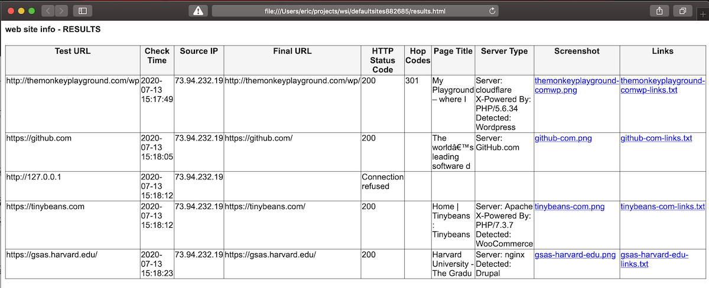
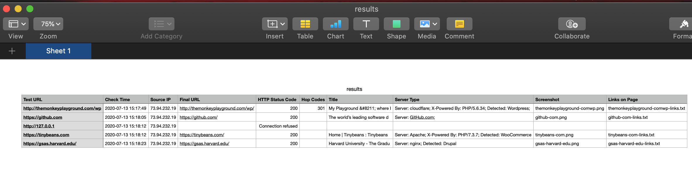
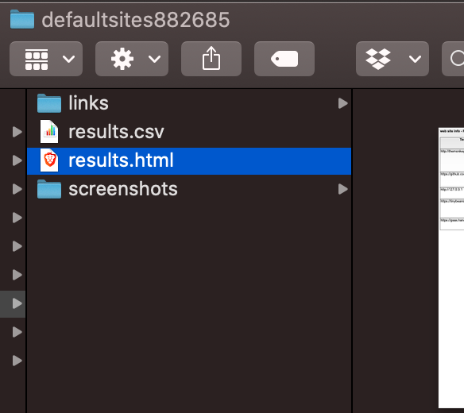

# web-site-info
grab details about a list of sites

Python script to query a list of web sites for a report on available information from the sites, including site technologies, screenshots, and links embedded.  Query straight or through a proxy.

Results are available in csv and HTML.

Use the defaultConfig.txt as a model for your query and the testList.txt as a model for the link list.

*usage* `./wsi.py -c configFile.txt`

web site info requires selenium and Firefox with gecko drivers to take the screenshots

https://pypi.org/project/selenium/

https://github.com/mozilla/geckodriver/releases

wsi.py in action `./wsi.py -c defaultConfig.txt`:

HTML report:

CSV report:

Collections of data:

